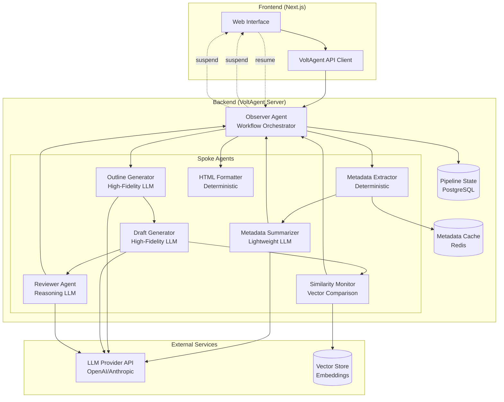

# Design Document

## Overview

The Content Engine Demo is a TypeScript-based implementation of a hub-and-spoke agentic system for generating original article content from competitor metadata. The system uses VoltAgent as the orchestration framework, integrating specialized agents for metadata processing, content generation, and quality assurance. The architecture emphasizes IP compliance through metadata-only extraction, human-in-the-loop control through workflow suspension gates, and measurable quality through automated scoring.

The demo consists of three main components:
1. **Backend Service**: VoltAgent-based workflow orchestration with specialized spoke agents
2. **Frontend Application**: Next.js web interface for pipeline management and human approval gates
3. **LLM Integration**: Configurable model slots for different generation and reasoning tasks

## Architecture

### System Architecture Diagram



### Technology Stack

**Backend:**
- **VoltAgent Core** (`@voltagent/core`): Workflow orchestration and agent management
- **VoltAgent Server** (`@voltagent/server-hono`): HTTP server with REST API endpoints
- **Node.js 18+**: Runtime environment
- **TypeScript 5+**: Type-safe development
- **PostgreSQL**: Pipeline state persistence
- **Redis**: Metadata caching layer
- **Zod**: Schema validation for workflow inputs/outputs

**Frontend:**
- **Next.js 14**: React framework with App Router
- **React 18**: UI component library
- **TypeScript**: Type-safe frontend development
- **TailwindCSS**: Utility-first styling

**LLM Integration:**
- **OpenAI API**: Primary LLM provider (configurable)
- **Ollama** (optional): Local LLM for development/testing
- **Vector Store**: Embeddings storage for similarity checking (Pinecone/Qdrant/local)

## Components and Interfaces

### 1. Observer Agent (Workflow Orchestrator)

The Observer Agent is the central hub that manages pipeline state and routes execution through specialized spokes.

**Responsibilities:**
- Initialize pipeline state from competitor URL input
- Route execution through spoke agents in correct sequence
- Suspend workflow at human gates and wait for resume signals
- Implement iterative refinement loop for quality/originality checks
- Track metrics (cost, time, quality scores)
- Maintain audit log of all state transitions

**Implementation:**
```typescript
// Workflow definition using VoltAgent
const contentPipeline = new Workflow({
  id: 'content-pipeline',
  inputSchema: z.object({
    competitorUrl: z.string().url(),
    editorId: z.string(),
  }),
  outputSchema: z.object({
    status: z.enum(['published', 'rejected', 'failed']),
    html: z.string().optional(),
    executionId: z.string(),
  }),
})
```

**State Management:**
- Pipeline states: INITIALIZED → METADATA_EXTRACTED → OUTLINE_PENDING_APPROVAL → CONCEPTS_APPROVED → OUTLINE_GENERATED → DRAFT_GENERATED → REVIEW_COMPLETE → DRAFT_PENDING_APPROVAL → DRAFT_APPROVED → COMPLETED
- State persistence in PostgreSQL with execution history
- Suspension metadata includes reason, step ID, and context data

### 2. Metadata Extractor (Deterministic Spoke)

Extracts safe, publicly visible metadata from competitor URLs without processing body content.

**Responsibilities:**
- Fetch HTML content from competitor URL
- Parse and extract title, meta description, h1-h3 headings
- Exclude all body paragraphs and expressive content
- Cache results to avoid redundant fetches
- Handle malformed HTML gracefully

**Implementation Approach:**
- Use `cheerio` for HTML parsing (deterministic, zero-cost)
- Implement caching layer with Redis (TTL: 24 hours)
- Fallback to lightweight LLM only for severely malformed HTML
- Return structured metadata object

**Interface:**
```typescript
interface MetadataExtractorInput {
  url: string;
}

interface MetadataExtractorOutput {
  title: string;
  metaDescription: string;
  headings: {
    h1: string[];
    h2: string[];
    h3: string[];
  };
  extractedAt: string;
}
```

### 3. Metadata Summarizer (Lightweight LLM Spoke)

Creates legal abstraction layer by converting metadata into high-level concepts.

**Responsibilities:**
- Analyze extracted metadata for themes and topics
- Generate 5-7 concept strings describing "what" not "how"
- Ensure concepts are abstract enough to avoid IP issues
- Use lightweight LLM model for cost efficiency

**Model Configuration:**
- Model slot: `SUMMARIZER_MODEL` (e.g., GPT-3.5-turbo, Claude Haiku)
- Temperature: 0.0 (deterministic)
- Max tokens: 500

**Interface:**
```typescript
interface SummarizerInput {
  metadata: MetadataExtractorOutput;
}

interface SummarizerOutput {
  concepts: string[];
}
```

**Prompt Template:**
```
You are an expert editor. Given competitor metadata, extract 5-7 key high-level 
concepts/themes discussed. Focus on WHAT topics are covered, not HOW they are expressed.

Metadata: {metadata}

Respond with a JSON array of concept strings.
```

### 4. Human Gate: Concept Approval

First suspension point for editorial control over topic selection.

**Responsibilities:**
- Suspend workflow execution after concept extraction
- Expose concepts to editor through API
- Wait for editor approval/rejection decision
- Resume workflow with editor feedback

**Implementation:**
```typescript
.andThen({
  id: 'gate-concept-approval',
  execute: async ({ data, suspend, resumeData }) => {
    if (resumeData && resumeData.gate === 'concepts') {
      return {
        conceptsApproved: resumeData.approved,
        conceptComments: resumeData.comments,
      };
    }
    
    await suspend('Waiting for concept approval', {
      gate: 'concepts',
      concepts: data.concepts,
    });
    
    return {};
  },
})
```

**Resume Data Schema:**
```typescript
{
  gate: 'concepts',
  approved: boolean,
  comments: string
}
```

### 5. Outline Generator (High-Fidelity LLM Spoke)

Generates structured article outline from approved concepts.

**Responsibilities:**
- Create article structure with introduction, main sections, conclusion
- Apply SEO best practices (keyword placement, heading hierarchy)
- Ensure logical flow and comprehensive coverage
- Return structured outline object

**Model Configuration:**
- Model slot: `OUTLINE_MODEL` (e.g., GPT-4, Claude Sonnet)
- Temperature: 0.7 (creative but controlled)
- Max tokens: 1500

**Interface:**
```typescript
interface OutlineInput {
  concepts: string[];
  seoGuidelines?: string;
}

interface OutlineOutput {
  title: string;
  introduction: string[];
  sections: Array<{
    heading: string;
    keyPoints: string[];
  }>;
  conclusion: string[];
}
```

### 6. Draft Generator (High-Fidelity LLM Spoke)

Produces complete article draft from outline.

**Responsibilities:**
- Generate full article with introduction, body, conclusion
- Maintain consistent tone and style
- Ensure originality and distinctiveness from source
- Follow outline structure closely

**Model Configuration:**
- Model slot: `DRAFT_MODEL` (e.g., GPT-4, Claude Sonnet)
- Temperature: 0.8 (creative, high-quality prose)
- Max tokens: 4000

**Interface:**
```typescript
interface DraftInput {
  outline: OutlineOutput;
  tone?: string;
}

interface DraftOutput {
  title: string;
  metaDescription: string;
  bodyParagraphs: string[];
  wordCount: number;
}
```

### 7. Reviewer Agent (Reasoning LLM Spoke)

Provides automated quality assurance through structured critique.

**Responsibilities:**
- Evaluate draft for clarity, coherence, tone, SEO strength
- Generate numeric quality score (0-100)
- Provide structured critique with specific feedback
- Identify areas for improvement

**Model Configuration:**
- Model slot: `REVIEWER_MODEL` (e.g., GPT-4, Claude Sonnet)
- Temperature: 0.5 (balanced)
- Max tokens: 1000

**Interface:**
```typescript
interface ReviewerInput {
  draft: DraftOutput;
}

interface ReviewerOutput {
  score: number; // 0-100
  comments: string;
  strengths: string[];
  improvements: string[];
}
```

**Quality Threshold:** Score must be ≥ 80 to proceed to human gate

### 8. Similarity Monitor (Vector Comparison Spoke)

Measures originality against competitor metadata using embeddings.

**Responsibilities:**
- Generate embeddings for draft content
- Retrieve competitor metadata embeddings from vector store
- Calculate cosine distance for distinctiveness score
- Ensure score meets originality threshold

**Implementation Approach:**
- Use OpenAI embeddings API (text-embedding-3-small)
- Store competitor embeddings in vector database
- Calculate cosine distance: `1 - cosine_similarity`
- Cache embeddings for performance

**Interface:**
```typescript
interface SimilarityInput {
  draft: DraftOutput;
  competitorMetadata: MetadataExtractorOutput;
}

interface SimilarityOutput {
  distinctivenessScore: number; // 0-1 scale
  similarityDetails: {
    titleSimilarity: number;
    contentSimilarity: number;
  };
}
```

**Originality Threshold:** Distinctiveness score must be ≥ 0.7 to proceed

### 9. Iterative Refinement Loop

Implements quality control through automated revision cycles.

**Logic:**
```typescript
.andWhen({
  condition: ({ data }) => 
    data.reviewScore < 80 || data.distinctivenessScore < 0.7,
  then: (workflow) => workflow
    .andThen({
      id: 'trigger-revision',
      execute: async ({ data }) => {
        // Log revision trigger
        // Increment revision count
        // Route back to Draft Generator with feedback
        return { needsRevision: true };
      },
    })
    .andAgent(
      ({ data }) => ({
        outline: data.outline,
        feedback: data.reviewerComments,
      }),
      DraftGenerator
    ),
  else: (workflow) => workflow.andThen({
    id: 'quality-passed',
    execute: async () => ({ qualityCheckPassed: true }),
  }),
})
```

**Revision Limits:** Maximum 3 revision cycles before escalating to human review

### 10. Human Gate: Draft Approval

Second suspension point for final editorial review.

**Responsibilities:**
- Suspend workflow after passing automated quality checks
- Expose draft, quality score, distinctiveness score to editor
- Wait for editor approval/rejection decision
- Route to formatter on approval or back to generator on rejection

**Implementation:**
```typescript
.andThen({
  id: 'gate-draft-approval',
  execute: async ({ data, suspend, resumeData }) => {
    if (resumeData && resumeData.gate === 'draft') {
      return {
        draftApproved: resumeData.approved,
        draftComments: resumeData.comments,
      };
    }
    
    await suspend('Waiting for draft approval', {
      gate: 'draft',
      draft: data.draft,
      qualityScore: data.reviewScore,
      distinctivenessScore: data.distinctivenessScore,
    });
    
    return {};
  },
})
```

### 11. HTML Formatter (Deterministic Spoke)

Converts approved draft to production-ready HTML.

**Responsibilities:**
- Transform draft structure to semantic HTML5
- Apply proper heading hierarchy (h1, h2, h3)
- Include meta tags for SEO
- Use templating engine (Handlebars/Nunjucks)

**Implementation Approach:**
- Deterministic templating (zero LLM cost)
- Validate HTML output
- Include structured data markup
- Complete within 1 second

**Interface:**
```typescript
interface FormatterInput {
  draft: DraftOutput;
}

interface FormatterOutput {
  html: string;
  wordCount: number;
  formattedAt: string;
}
```

**Template Structure:**
```html
<!DOCTYPE html>
<html lang="en">
<head>
  <meta charset="UTF-8">
  <title>{{title}}</title>
  <meta name="description" content="{{metaDescription}}">
</head>
<body>
  <article>
    <h1>{{title}}</h1>
    {{#each bodyParagraphs}}
      <p>{{this}}</p>
    {{/each}}
  </article>
</body>
</html>
```

### 12. REST API Endpoints

VoltAgent server exposes HTTP endpoints for workflow management.

**Endpoints:**

1. **Start Pipeline**
   - `POST /workflows/content-pipeline/execute`
   - Body: `{ input: { competitorUrl: string, editorId: string } }`
   - Response: `{ success: boolean, data: { executionId: string, status: string } }`

2. **Get Pipeline State**
   - `GET /workflows/content-pipeline/executions/:executionId/state`
   - Response: `{ success: boolean, data: { executionId, status, suspension?, context } }`

3. **Resume Pipeline**
   - `POST /workflows/content-pipeline/executions/:executionId/resume`
   - Body: `{ resumeData: { gate: string, approved: boolean, comments: string } }`
   - Response: `{ success: boolean, data: { executionId, status } }`

4. **Stream Pipeline Events** (Optional)
   - `POST /workflows/content-pipeline/stream`
   - Returns: Server-Sent Events stream
   - Events: workflow-start, step-start, step-complete, workflow-suspended, workflow-complete

### 13. Frontend Application

Next.js application providing web interface for pipeline management.

**Pages:**

1. **New Article Page** (`/new-article`)
   - Form to submit competitor URL
   - Start pipeline button
   - Display execution ID on success

2. **Workflow Status Page** (`/workflow/[executionId]`)
   - Poll workflow state every 3 seconds
   - Display current status and progress
   - Route to appropriate gate component based on suspension

**Components:**

1. **ConceptApproval Component**
   - Display extracted concepts
   - Radio buttons for approve/reject
   - Comments textarea
   - Submit button to resume workflow

2. **DraftApproval Component**
   - Display draft content
   - Show quality score and distinctiveness score
   - Radio buttons for approve/reject
   - Comments textarea
   - Submit button to resume workflow

3. **WorkflowProgress Component** (Optional)
   - Real-time event stream display
   - Show current step and progress
   - Visual pipeline diagram

## Data Models

### Pipeline Execution State

```typescript
interface PipelineExecution {
  executionId: string;
  workflowId: string;
  status: 'running' | 'suspended' | 'completed' | 'rejected' | 'failed';
  input: {
    competitorUrl: string;
    editorId: string;
  };
  context: {
    metadata?: MetadataExtractorOutput;
    concepts?: string[];
    outline?: OutlineOutput;
    draft?: DraftOutput;
    reviewScore?: number;
    distinctivenessScore?: number;
    revisionCount?: number;
  };
  suspension?: {
    suspendedAt: string;
    reason: string;
    stepId: string;
    data: Record<string, any>;
  };
  metrics: {
    startedAt: string;
    completedAt?: string;
    totalCost?: number;
    tokenUsage?: {
      summarizer: number;
      outline: number;
      draft: number;
      reviewer: number;
    };
  };
  auditLog: Array<{
    timestamp: string;
    event: string;
    stepId: string;
    data: Record<string, any>;
  }>;
}
```

### Vector Embedding Record

```typescript
interface EmbeddingRecord {
  id: string;
  competitorUrl: string;
  contentType: 'metadata' | 'draft';
  embedding: number[]; // 1536-dimensional vector
  metadata: {
    title: string;
    extractedAt: string;
  };
  createdAt: string;
}
```

## Error Handling

### Error Categories

1. **Validation Errors**
   - Invalid URL format
   - Missing required fields
   - Schema validation failures
   - HTTP 400 response

2. **External Service Errors**
   - LLM API failures (rate limits, timeouts)
   - Vector store unavailability
   - Database connection errors
   - Implement exponential backoff retry (max 3 attempts)

3. **Workflow Errors**
   - Execution not found (HTTP 404)
   - Invalid state transitions
   - Resume data validation failures
   - Log error and update execution status to 'failed'

4. **Quality Threshold Failures**
   - Max revision cycles exceeded (3 cycles)
   - Persistent low quality/originality scores
   - Escalate to human review with detailed context

### Error Response Format

```typescript
interface ErrorResponse {
  success: false;
  error: {
    code: string;
    message: string;
    details?: Record<string, any>;
  };
}
```

### Retry Strategy

- LLM API calls: 3 retries with exponential backoff (1s, 2s, 4s)
- Database operations: 2 retries with 500ms delay
- HTTP requests: 2 retries with 1s delay
- Log all retry attempts for monitoring

## Testing Strategy

### Unit Tests

**Deterministic Components:**
- Metadata Extractor: Test HTML parsing with various page structures
- HTML Formatter: Test template rendering with different draft structures
- Similarity Monitor: Test cosine distance calculations with known vectors
- API Client: Test request/response handling with mocked endpoints

**Coverage Target:** 90% for deterministic code

### Integration Tests

**Workflow Orchestration:**
- Test complete pipeline flow from URL to HTML output
- Test suspension and resume at both human gates
- Test iterative refinement loop with quality thresholds
- Test error handling and retry logic

**Mock Strategy:**
- Mock LLM API responses with realistic outputs
- Mock vector store operations
- Use in-memory database for state persistence

### Manual Sampling

**LLM-Powered Components:**
- Sample 5% of generated outlines for structure quality
- Sample 5% of generated drafts for tone and originality
- Sample 5% of reviewer critiques for accuracy
- Senior editor review of sampled outputs

### End-to-End Tests

**Full System Tests:**
- Test complete user journey from frontend to backend
- Test both approval and rejection paths at gates
- Test concurrent pipeline executions
- Test system behavior under load

## Monitoring and Observability

### Metrics Collection

**Pipeline Metrics:**
- Executions started per hour
- Executions completed per hour
- Average time to completion
- Human approval rate at each gate
- Revision cycle frequency

**Cost Metrics:**
- Token usage per spoke agent
- Cost per pipeline execution
- Total daily/monthly LLM costs
- Cache hit rate for metadata extraction

**Quality Metrics:**
- Average quality scores
- Average distinctiveness scores
- Rejection rate at draft approval gate
- Revision cycle distribution

### Logging Strategy

**Structured Logging:**
- Use Pino for structured JSON logs
- Include execution ID in all log entries
- Log levels: DEBUG, INFO, WARN, ERROR
- Separate log streams for audit trail

**Audit Trail:**
- Log all state transitions with timestamps
- Log all LLM API calls with prompts and responses
- Log all human approval decisions
- Retain audit logs for 90 days

### Alerting

**Cost Alerts:**
- Warning: Single pipeline exceeds $10
- Critical: Single pipeline exceeds $15
- Daily cost exceeds budget threshold

**Quality Alerts:**
- Human approval rate drops below 80% (24-hour window)
- Average quality score drops below 75 (24-hour window)
- Revision cycle rate exceeds 40%

**System Alerts:**
- LLM API error rate exceeds 5%
- Database connection failures
- Workflow execution failures exceed 10%

### Dashboard

**Real-Time Metrics:**
- Active pipeline executions
- Pipelines awaiting human approval
- Recent completions and rejections
- Current cost burn rate
- LLM API response times

**Historical Trends:**
- Daily execution volume
- Cost trends over time
- Quality score trends
- Approval rate trends

## Security Considerations

### Authentication

- JWT-based authentication for API endpoints
- Editor role verification for approval actions
- Execution ID ownership validation
- Secure token storage in frontend

### Data Protection

- HTTPS for all API communication
- Sanitize competitor URLs to prevent SSRF attacks
- Validate and escape all user inputs
- Secure storage of API keys in environment variables

### Rate Limiting

- Per-user rate limits on pipeline creation (10/hour)
- Global rate limits on API endpoints
- LLM API quota management
- Implement request throttling

## Deployment Architecture

### Development Environment

- Local VoltAgent server on port 3141
- Local PostgreSQL database
- Local Redis instance
- Ollama for local LLM testing (optional)
- Next.js dev server on port 3000

### Production Environment

- VoltAgent server deployed on Node.js hosting (e.g., Railway, Render)
- Managed PostgreSQL (e.g., Supabase, Neon)
- Managed Redis (e.g., Upstash, Redis Cloud)
- Next.js deployed on Vercel
- LLM API: OpenAI or Anthropic
- Vector store: Pinecone or Qdrant Cloud

### Environment Variables

```
# Backend
DATABASE_URL=postgresql://...
REDIS_URL=redis://...
OPENAI_API_KEY=sk-...
VECTOR_STORE_URL=https://...
PORT=3141

# Frontend
NEXT_PUBLIC_VOLTAGENT_URL=http://localhost:3141
NEXT_PUBLIC_API_KEY=...
```

## Performance Considerations

### Optimization Strategies

1. **Caching:**
   - Cache metadata extraction results (24-hour TTL)
   - Cache embeddings for competitor URLs
   - Cache LLM responses for identical inputs (optional)

2. **Parallel Processing:**
   - Run Reviewer Agent and Similarity Monitor in parallel
   - Batch embedding generation when possible

3. **Resource Management:**
   - Connection pooling for database
   - Redis connection reuse
   - LLM API request queuing to respect rate limits

4. **Response Times:**
   - Metadata extraction: < 5 seconds
   - Concept summarization: < 10 seconds
   - Outline generation: < 15 seconds
   - Draft generation: < 30 seconds
   - Review + similarity: < 10 seconds (parallel)
   - HTML formatting: < 1 second
   - **Total automated time: ~70 seconds** (excluding human gates)

### Scalability

- Horizontal scaling of VoltAgent server instances
- Database read replicas for state queries
- Redis cluster for distributed caching
- Queue-based architecture for high-volume scenarios (future enhancement)

## Future Enhancements

1. **Multi-Language Support:** Generate content in multiple languages
2. **Custom Style Guides:** Allow editors to define brand-specific tone and style
3. **Batch Processing:** Process multiple competitor URLs in parallel
4. **A/B Testing:** Generate multiple draft variations for comparison
5. **SEO Optimization:** Advanced keyword research and optimization
6. **Content Scheduling:** Schedule publication times
7. **Analytics Integration:** Track published article performance
8. **Collaborative Editing:** Multiple editors can review and comment
9. **Version History:** Track all revisions and changes
10. **Export Formats:** Support for Markdown, PDF, DOCX output
